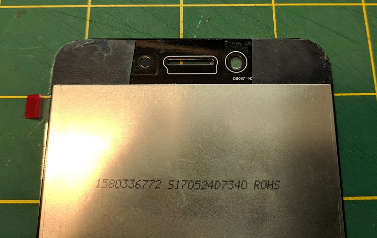
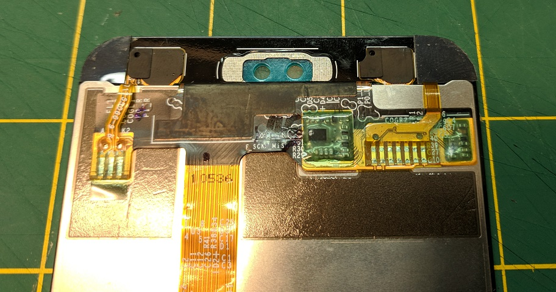
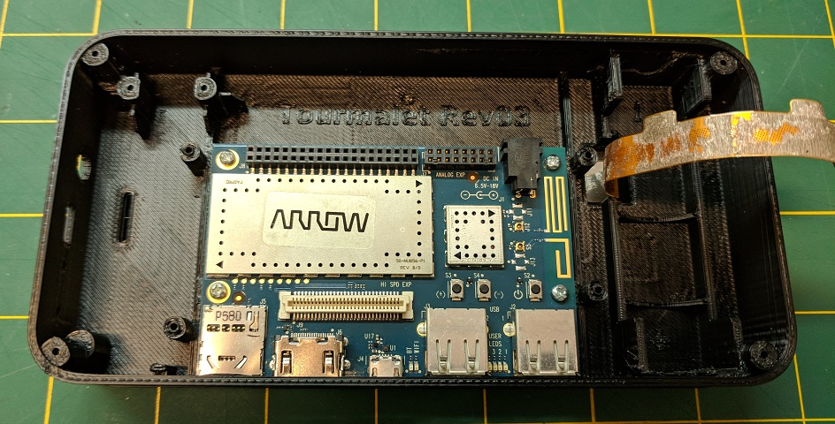
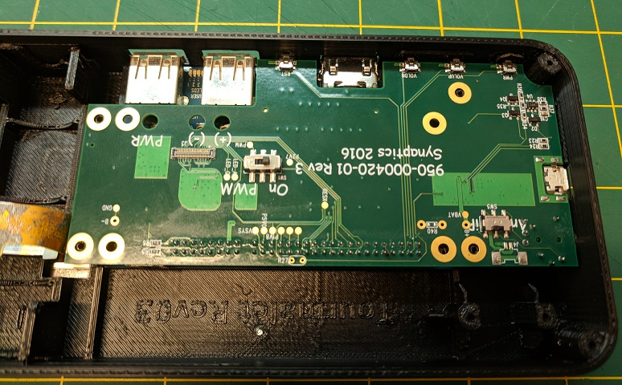
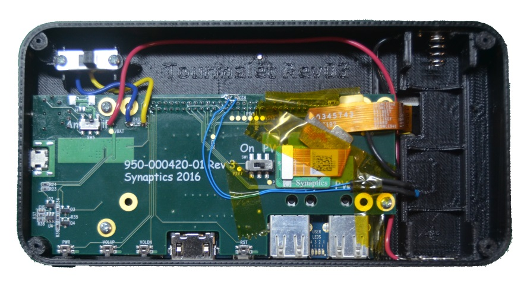

 

&copy; 2018 Synaptics, Incorporated. All Rights Reserved
# Tourmalet Hardware Assembly

last update: May 10, 2018

Contact [Synaptics](mailto:tourmalet@synaptics.com)

This document will show how to assemble your Tourmalet device

Note that some of the pictures show some steps out of order because we were still in the process of determining the best assembly order when the pictures were taken.

1. Prepare the plastic housing
	- Chase screw holes with 1/16" drill bit
	- Check clearance of button, shave parts down as necessary- you may still need to modify the buttons when installing the daughter board for propler switch operation
	- Clean up battery tab slots. Use a hobby knife to make sure there is no 3D printed material sticking together in the battery contact slots. A regular hobby knife should be just wide enough to fit in the slots

1. Soldering
	- Solder wires to the battery contacts
    	- If color coding the wires, the bump tab should have approx. 150mm of red 22 gauge wire, and the spring tab should have aboput 70mm of black 22 gauge wire
      	- It may help to slightly bend the tabs of the battery contacts at the holes so the wire clears the housing when assembled together
	- Power switch
    	- Solder wires to power switch on the center contact and one side lug. Use 40mm 22 or 24 gauge wire
     	- Solder wires from power switch to daughter board
     	- If not using power switch, solder 0 ohm resistor to R40 on daughter board
     
     

	- Solder analog header to DragonBoard
    	- To make it easier, first plug the header into the daughter board, then plug the daughter board into the Dragon Board. This helps hold the header in place as you start soldering
	- Solder ~80mm extension wires (30ga wirewrap wire is probably sufficient) to thermistor, heat shrink, then solder to the daughter board
	- There is still one more soldering step, but that will come at a later stage of the assembly
 
1. Battery contact installation
 	- Using needle nose pliers or the tip of a flathead screwdriver, press battery contacts into slots.
 	- The bump contact should go on the positive side, and the spring contact goes on the negative side

1. Housing assembly (for two part housing)
	- If using the two-piece housing, the parts need to be assembled together.There are six screw holes for attaching the two halves, but you are also welcome to use adhesive too (solvent, epoxy, or pressure sensitive adhesive).
 	- Apply any adhesive, if using
 	- Screw the two hlaves together with four M2x5mm pan head screws in the corners and two M2x3 flathead screws on the sides (optional. but recommended for best fit and finish)
 	- Make sure the screw heads are not sticking up past the flat areas of the housing by them
   
	

1. LCD installation
	- Peel connector tail loose from the back of the LCD
	- Remove the protective film from the back of the touchscreen lens
	- Apply adhesive to back of the touchscreen lens
    	- We recommend 3M 5909 VHB adhesive because the surface of the 3D printed case is not smooth, so a thin double sided tape will probably not adhere well. Some sort of conformal adhesive at least 0.20mm thickshould yield best results. In a pinch carpet tape could be used, but it will not stick as well to the glass lens as the VHB adhesive.
     	- The adhesive needs only be applied to the corners of the bottom half of the touchscreen, and clear the speaker hole on the upper half.
     	- The adhesive can be applied overlapping the edge of the lens then trimmed.
	- Feed the LCD cable through the hole in the case, then attach the screen to the housing

	
    
	

1. Boards installation
	- Install DragonBoard with four M2x5 screws (make sure the DIP switches are set to "off" before doing so, as they can not be accessed once screwed in).

	

	- Install buttons, then plug daughter board into DragonBoard.
    	- Insert headphone end of daughter board into housing, then press daughter board into DragonBoard
    	- Check button operation to be sure the volume and power buttonsmove freely and have a tactile click. Enlarge holes or shave down buttons as necessary
	- Screw daughter board in with four M3x5 screws

	

	- Orient switch with wires toward top of housing, and screw in with two M3x5 screws. 

1. Route battery wires around daughter board and solder positive (red) wire to B+ contact and negative (black) wire to B- contact.

1. Plug LCD adapter board into daughter board and tape down tail

1. Route thermistor to battery compartment and tape down wires

	

## WiFi Antenna ##
Qualcomm application note [LM80-P0436-42 Rev. C ](https://developer.qualcomm.com/qfile/29467/lm80-p0436-42_c_add_ufl_ant_validate_gps_on_android_linux.pdf) has information on how to add U.FL antenna connectors to the DragonBoard 410c. Note that antennas usually need to be designed for the system. Though the DragonBoard antennas were not designed with the daughter board in mind, just sourcing and adding an aftermarket antenna may not improve WiFi or GPS reception either.