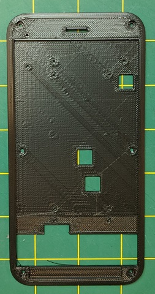
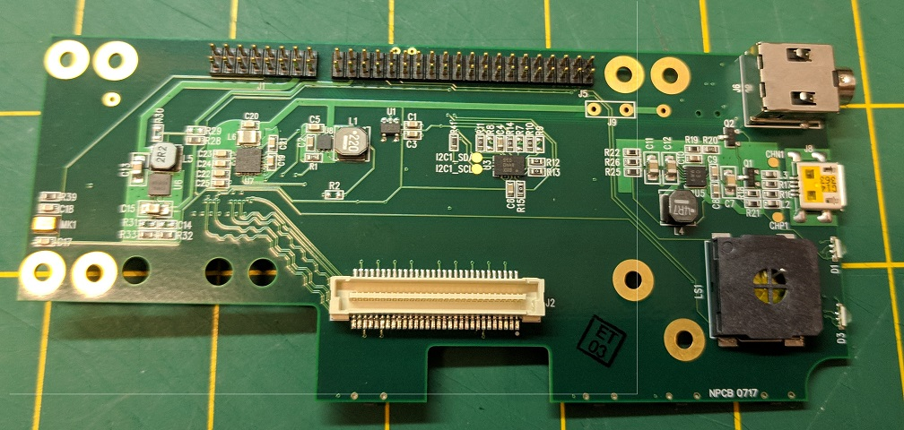
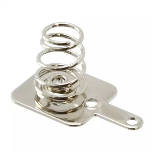
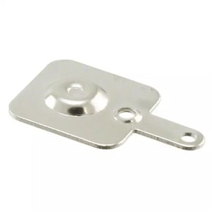
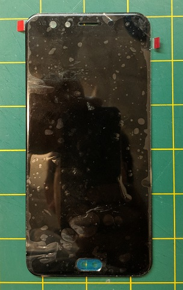
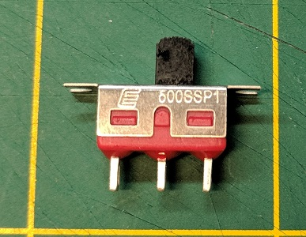

 

&copy; 2018 Synaptics, Incorporated. All Rights Reserved
# Tourmalet Hardware Bill Of Materials

last update: May 10, 2018

Contact [Synaptics](mailto:tourmalet@synaptics.com)

This document tells you what all the parts are, where to get them, and what they look like.

## Parts list, and where to get them
| Item                                                        | Component (click link for source)                                                                                                                             | Quantity | Comments                               |
|-------------------------------------------------------------|---------------------------------------------------------------------------------------------------------------------------------------------------------------|----------|----------------------------------------|
| [3D Housing](#3d-printed-housing)                           | 3D case (Rev03a): [top](../Casing/Rev03a_shell_top.STL) and [bottom](../Casing/Rev03a_shell_bottom.STL)- or [one piece](../Casing/Rev03a_one_piece_shell.STL) | 1        |                                        |
| [3D printed buttons](#3d-printed-buttons)                   | [3D printed buttons](../Casing/Rev03a_buttons.stl)                                                                                                            | 1        |                                        |
| [Processor platform](#dragonboard)                          | [Qualcomm Dragonboard 410c](https://www.arrow.com/en/products/dragonboard410c/arrow-development-tools)                                                        | 1        | May need to order from eBay            |
| Daughterboard connector                                     | 16-pin, 2 mm double row header, Digikey [609-2660-ND](https://www.digikey.com/product-detail/en/amphenol-fci/63453-116LF/609-2660-ND )                        | 1        |                                        |
| [Daughterboard](#daughter-board)                            | Synaptics internal part 950-000420-01                                                                                                                         | 1        |Contact [Synaptics](mailto:tourmalet@synaptics.com)                                        |
| [Battery contacts](#battery-contacts)                       | Negative: Digikey [36-5201-ND](https://www.digikey.com/product-detail/en/keystone-electronics/5201/36-5201-ND)                                                | 1        |                                        |
|                                                             | Positive: Digikey [36-5223-ND](https://www.digikey.com/product-detail/en/keystone-electronics/5223/36-5223-ND )                                               | 1        |                                        |
| [Touchscreen](#touchscreen)                                 | Tianma TL055VVMS15-00 (Synaptics TDDI)                                                                                                                        | 1        |Contact [Synaptics](mailto:tourmalet@synaptics.com)                                        |
| [LCD Adaptor Board](#lcd-adaptor-board)                     | Synaptics internal part 950-000550-01                                                                                                                         |1          |Contact [Synaptics](mailto:tourmalet@synaptics.com)                                        |
| [Power Switch](#power-switch)                               | SPDT switch: Digikey [EG2476-ND](https://www.digikey.com/product-detail/en/e-switch/EG2476-ND)                                                                | 1        |                                        |
| [Battery](#battery)                                         | [18650 Li-Ion battery](https://www.ebay.com/gds/18650-Battery-Buying-Guide-/10000000177628747/g.html)                                                         | 1        | Various sources; see ebay buying guide |
| [Themistor](#battery)                                       | Digikey [490-8601-ND](https://www.digikey.com/product-detail/en/murata-electronics-north-america/NXRT15XH103FA1B030/490-8601-ND/3788625)                      | 1        |                                        |
| Screws                                                      | M2 x 5 pan head                                                                                                                                               | 12       |                                        |
|                                                             | M2 x 3 flat head                                                                                                                                              | 2        |                                        |
| Misc. Wire                                                  | 22 or 24 gauge in various colors (red, black, etc.)                                                                                                           | TBD      |                                        |
| [Pressure Sensitive Adhesive](#pressure-sensitive-adhesive) | 3M VHB 5909, 486MP, or similar                                                                                                                                | TBD      |                                        |

## Further explanation of the parts

### 3D Printed Housing
Part files are available as two pieces- [top](../Casing/Rev03a_shell_top.STL) and [bottom](../Casing/Rev03a_shell_bottom.STL)- or [one](../Casing/Rev03a_one_piece_shell.STL). The one-piece housing may be more difficult to print correctly and only saves 1mm in height.

 

### 3D Printed Buttons
Same [part](../Casing/Rev03a_buttons.STL) is used for both two-piece and single piece shell.

### DragonBoard
We are using the Dragonboard 410c.  This SBC is available from various online resellers. We got ours from [Arrow](https://www.arrow.com/en/products/dragonboard410c/arrow-development-tools), though you may need to check around as the 410c was released in 2016, so it's getting a bit old.
We will flash our build image after assembly, but make sure the DIP switches are all set to OFF.

### Daughter Board
This Synaptics-design daughterboard (950-000420-01) contains a MIPI DSI connector (via an [adaptor board](#lcd-adaptor-board)), 3.3V display power, drive current for LED display backlight (and switch), speaker, battery charging, headphone jack, expansion connector, power for USB ports, and 9-axis sensor (magnetometer, accelerometer and gyroscope).  

All information needed to build this board (BOM, Schematic, PCB artwork) is contained in the *Synaptics_Boards* directory. However, we are assuming that you have an assembled daughterboard already, as the sourcing, PCB fab, assembly, and testing of this board is a rather advanced project in itself.  Contact [Synaptics](mailto:tourmalet@synaptics.com) for further information about sources for this board.

### Battery Contacts
Digikey part numbers available in the table above.

 

### Touchscreen
This is a Tianma TL055VVMS15-00 in-cell touchscreen display with an integrated cover lens.  It is a 5.46" FHD (1920 x 1080) touchscreen module, with integrated cover lens.  This touchscreen module features a Synaptics TD4322 touch-display driver integration (TDDI) chipset to provide high-performance in-cell capacitive multitouch.  Communication with the dragonboard is done via a MIPI DSI connection.  

In order to get the current version of Tourmalet to work with the supplied software binary image, it is critical that this exact touchscreen display be used.  No other display will work with this software binary, as the display configuration parameters in the binary are specifically tuned to this display. 

Contact [Synaptics](mailto:tourmalet@synaptics.com) for further information about sourcing this display.

### LCD Adaptor Board
Currently, the daughterboard (520-000420-01) with all the DragonBoard interface connectors (mezzanine connector, analog hconnector, and high speed digital signals) was designed for an LCD with a different pinout, even though it has the same connector as the Tianma LCD used in this case. This LCD adapter board (520-000550-01) is needed to work with the Tianma LCD. A future iteration of the daughterboard might correct the LCD pinout to eliminate this adapter board.  

All information about this board (BOM, schematic, PCB artwork) can be found in the *Synaptics_Boards* directory, though sourcing the connector may be an issue. Contact [Synaptics](mailto:tourmalet@synaptics.com) for further information about sources for this board.

### Power Switch

Because we have not been successful at controlling the DragonBoard's PMIC, it is currently not possible to shut down the processor via software. Attempting to do so only works until the watchdog timer turns the Dragonboard back on again.  Accordingly, we have included a power switch, so you do not have to remove the battery whenever you want to turn off your Tourmalet device. Regular standby does work to shut off the LCD (and possibly put the processor in a lower power state?), but will still eventually drain the battery.
The power switch can be bypassed and not even used by putting a jumper (or zero ohm resistor) in part R40 on the daughter board.

### Battery
The battery used here is a relatively standard size rechargeable Lithium Ion cell. There is much more information available about these batteries than we can relay here, thus the link to a quick primer on eBay, above.

Due to the battery contacts, we recommend the use of button top (instead of flat top) batteries. We also recommend the use of protected cells for general safety. A protected 18650 battery is one that has a circuit on it to prevent electrical damage to the cell due to such factors as over charging, over discharging, short circuits, etc. 

Being a Lithium Ion battery, there are certain precautions one should follow when using it to reduce the risk of fire. We attempt to prevent charging problems by using a lithium ion specific charging ASIC, and we charge the battery at a moderate current. This means that the battery does not charge as fast as it could, but it also allows for different capacity batteries and also extends their service life.

We also provide contacts for the thermistor that the charging ASIC has provisions for. This thermistor is placed next to the battery so that charging circuit can reduce the charging current if the battery is getting too hot. Unfortunately, on the most recent board (as of April 2018), these contact are far from the actual battery itself, so the thermistor needs to have additional wires soldered to it so that it can properly be placed by the battery.

### Pressure Sensitive Adhesive
This adhesive needs to be able to stick well to both the smooth glass of the touchscreen, and the rough surface of the 3D printed case. The 3M VHB is often used for attaching glass to plastic. For FFF 3D printed materials, the adhesive should be at least 0.2mm thick. The VHB 5909 used here is 0.3mm. We have done no rigorous testing to determine the optimal adhseive - we simply had this particular adhesive available, and it seems to work well enough to keep the touchscreen attached to the plastic case.

If the surface texture of the plastic case is smooth - for example, if the case is made from a smooth photoresin, or the surface has been smoothed with filler such as epoxy or Bondo- then a 3M 200 series adhesive, such as 468MP, might be acceptable.