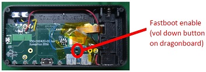

 

&copy; 2018 Synaptics, Incorporated. All Rights Reserved

# Installing Android on Tourmalet #

last update: May 10, 2018

Contact [Synaptics](mailto:tourmalet@synaptics.com)

- Install Android SDK from https://developer.android.com/studio/ or just the Platform Tools (smaller download/installation) from https://developer.android.com/studio/releases/platform-tools or, on Ubuntu Linux, fastboot as below:
```{r, engine=sh}
sudo add-apt-repository ppa:nilarimogard/webupd8
sudo apt-get update
sudo apt-get install android-tools-fastboot
```

- If you are using Ubuntu Linux, Install udev rules so that adb and fastboot will work without root permissions (or remember to use su or sudo to run adb and fastboot):

```{r, engine=sh}
git clone https://github.com/snowdream/51-android
sudo ln -s `pwd`/51-android/51-android.rules /etc/udev/rules.d/
sudo udevadm control --reload-rules
```
- Make sure the directory containing fastboot is in your `PATH` environment variable.

- Connect your Tourmalet device to your PC in fastboot mode:

	1. Unplug the device and make sure that the device is off
	2. Put in a charged battery (or plug device into charger via the top USB micro port).
	3. With a paperclip or other thin stick, press the *dragonboard's* volume down button (accessed via the middle hole in the daughterboard, located between the USB A ports) and then turn on power switch:

	

	4. Once you switch on the power, you can let go of the button.  Now wait about 20 seconds and then plug the device into your PC via the side USB micro port.
	5. Check to make sure your device is recognized with the `fastboot devices -l` command.
	6. For additional help, you can also refer to the [96boards fastboot help page](https://www.96boards.org/documentation/consumer/dragonboard410c/installation/linux-fastboot.md.html), especially steps 1 and 2.

- Extract [fastboot-images.zip](https://github.com/synaptics-cpt/tourmalet/releases/download/v1.0.0/fastboot-images.zip) (`unzip fastboot-images.zip`).  

- On Windows, run `flash-all.bat`; on other platforms, `./flash-all.sh`.

- If you built your own image from source (using [Building Android](BuildingAndroid.md)), you will need to run these commands (that is, building your own "flash-all" script):

```{r, engine=sh}
for i in boot system userdata persist recovery; do fastboot flash $i APQ8016_420C_LA.BR.1.2.4-01810-8x16.0_5.1.1_Lollipop_P2/out/target/product/msm8916_64/$i.img; done
fastboot reboot
```
