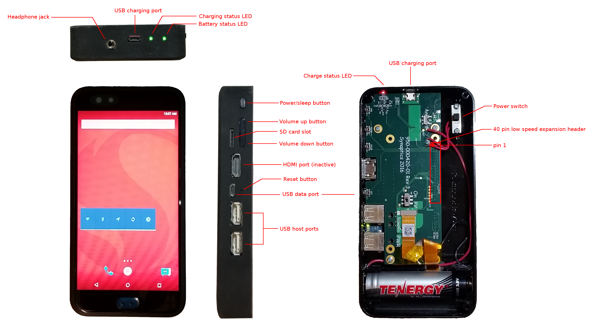
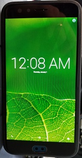
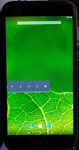
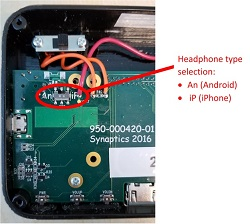

 

&copy; 2018 Synaptics, Incorporated. All Rights Reserved

# User Guide #
last update: May 10, 2018

Contact [Synaptics](mailto:tourmalet@synaptics.com)

This user guide will take you through the basics of your Tourmalet device in terms of how to use it as a portable media player.  If you are interested in accessing Tourmalet's GPIO's and other hardware, refer to the [Developer Guide](DeveloperGuide.md). This guide assumes that you already have an [assembled device](Assembly.md) with the appropriate [software image installed](InstallingAndroid.md).  

Tourmalet runs the Lollipop version of Android, so you will find Tourmalet fairly similar in software operation to other Lollipop-era Android devices.  Accordingly, this document assumes familiarity with Android usage, and will only cover Tourmalet-specific issues. For more usage details about Lollipop Android, check out [Google's Lollipop User Guide](https://ss7.vzw.com/is/content/VerizonWireless/Devices/Android-Specific-Images/User%20Manual/android-5-lollipop-ug.pdf).

## Powering on (and off) Device
Make sure you have a charged battery inserted with the correct polarity.  If the battery is not charged, you can use your Tourmalet device to [charge your battery](#battery).

Turn the device on with the power switch on the back. A blue LED on the Dragonboard (between the USB data port and USB host port) may briefly flash.  This is followed by a green LED between the two USB host ports turning on. This LED will eventually turn off after initial booting and will probably be off by the time the display is on. The battery status indicator LED should also be on.  The display will remain dark for about 30 seconds before a splash screen appears. The splash screen will then be replaced by the Android home screen or lock screen.  If the display turns off after you see the splash screen, try pressing the power/sleep button, as the device may have already decided to turn off the display to save power.  If you see the Android lock screen (left image; the time is prominently displayed with a small lock icon at the bottom middle of the display), swipe up to unlock.  You should see the Android home screen (right image), 

Now, you are ready to start using your Tourmalet device.  If this is your first time, you will notice that there isn't all that much there.  To add more stuff onto the device, you will first need to turn on [WiFi](#wifi) to get your device onto your wireless network.  Additionally, you will need to side-load a web browser and app store to start loading stuff onto your device.  See the [Setting up Tourmalet](#setting-up-tourmalet-and-installing-apps) section below for some basic instructions on how to set-up your device for the first time.

The power/sleep button works pretty much like the power/sleep button on a cell phone.  That is, a brief press will turn off the display if it is on, and turn on the display if it is off.  A long press on the button will bring up the shutdown menu.  However, shutdown doesn't exactly power off the dragonboard:

To power off the device, you can simply use the power switch at the back of the device again.  This switch directly cuts power to the entire device.  We haven't noticed any particular issues in the software by doing this.  However, we still recommend that you "shutdown" Android first, by a long-press on the power/sleep button (then tap the "power off" button on the screen).  Once the display turns off, use the power switch (otherwise, the device will restart).  Remember, we added a power switch to the device because we were unsuccessful at accessing the Dragonboard's PMIC, so any attempt to power off the device via software will cause the device to ultimately restart (due to the watchdog timer timing out). 

## Setting up Tourmalet and Installing Apps ##

The first time, you start up your device, you will notice that there isn't much to do.  The calculator works, as does the stopwatch.  Other apps such as the phone, music, and videos, don't do much, as there is no cellular chipset or media content to play.  Even if [WiFi](#wifi) is operational, there is no web browser available on the initial image.  

So, the first thing you will likely need to do is install a web browser and an app store app to your device.  This can be done by connecting your Tourmalet to a PC running adb (also known as "side-loading"). Apps in the form of APK files can be installed with `adb install <filename>.apk`. 

Web browsers such as Chrome or [Mozilla](https://download.mozilla.org/?product=fennec-latest&os=android&lang=multi) are easily available as APKs with a quick Internet search. App stores from Amazon, F-Droid, and others are available as APKs.  These app stores will allow installation of additional apps through the interface on the Tourmalet device without the need to continue using adb. A list of popular alternatives to the Google Play store can be found in this [article](https://www.androidpit.com/best-google-play-store-alternative-app-stores).  

To date, we have side-loaded Mozilla, and the Amazon store.  Inside the Amazon store, we were able to download the Facebook app directly onto the Tourmalet device and then install and run Facebook.

**Note**:  Before launching the web browser for the first time, be sure to set the time, date, and time zone on your device (via the *Settings* menu).  Otherwise, you may get connection errors when you launch your web browser, due to timestamp mis-matches.

## WiFi ##

WiFi may take a few minutes to initialize, but once it does should work the same as any Android device. Due to the location and design of the antenna, signal may be weaker than desired. If you are experiencing issues or want a better connection, you can install a [replacement antenna](Assembly.md#wifi-antenna).

Please note that the WiFi upon start-up is disabled, so you need to enable WiFi each time you reboot the system.  We are not sure why the state of the device's WiFi connection is not preserved during shutdown/reboot (unlike Bluetooth).

## Audio ##

Tourmalet has volume up and down buttons on the side of the case (the edge of the daughterboard) in addition to the volume buttons on the DragonBoard (accessible through holes in the daughterboard).

Headphones with or without a microphone can be connected to the 3.5mm jack at the top of the case. Only for headphones with a microphone: next to the power switch is a smaller switch on the daughter board for Android-compatible headsets ("An" position) or iPhone-compatible headsets ("iP" position):  

The position of this switch is irrelevant if your headphone does not have a microphone.

Bluetooth audio devices can also be used.  Just go to the Settings menu in Android and pair your bluetooth audio device.  We have tested this with a pair of Bluetooth speakers.

Finally, there is a speaker built into the Synaptics daughterboard.  As of this build, the speaker does not seem to be enabled.

## USB ##

The Micro-USB port at the top of the case is for charging only. It can charge the battery whether the main power switch is on or off. See [battery](#battery) for more details. 

The Micro-USB port on the DragonBoard can be used for ADB, fastboot, and file transfer.

The two USB A ports can be used to connect devices such as mouse and keyboard.

## Battery ##

The Tourmalet device utilizes a relatively common and plentiful 18650 Li-ion battery.  This battery typically has between 3100 to 3400 mAhr capacity.  The *approximate* state of the battery is shown by the LED furthest from the USB charging port:

|Color				| Status						|
|-------------------|-------------------------------|
|Green				| Full charge					|
|Orange				| Not full charge				|
|Red				| Better think about charging	|

Look, this is a hobbyist project.  Just be happy that we put an LED to give you a rough idea of the state of the battery.  In previous projects that the team worked on, such an LED was not designed in.  You can imagine the stress level during customer demos when we would have no idea how much longer the demo would last before the battery died...

To give you a better idea of battery life, here are some preliminary power consumption measurements:

### Battery Life ###
|Device State			|Current draw (mA)	|Operating Time (Hours, based on 3400 mAhr battery	|
|-----------------------|-------------------|-------------------------------------------|
|"Sleep" (i.e. after pushing power/sleep button)	|60	|57 |
|Sleep + backlight forced on (see [Misc](#backlight-switch)) | 330 | 10 |
|Normal "idle" state (home screen), no WiFi, no BT | 380 | 9 |
|Normal, with BT, no WiFi	| 400 | 9 |
|Normal, with WiFi, no BT 	| 410 | 8	|
|Continuous Streaming Video on YouTube, WiFi, BT on, display always |	670 | 5	|
|Downloading app, WiFi, BT on	| 800 |	4	|

Basically, you can expect about 4 hours of continuous use from a fresh battery.  The default power management in Android shuts off the display after about a minute, so battery life may be much longer when the display is not always on.

**Note:** In some tests, we have seen a device consume about 800 mA in its sleep state, and about 1500 mA (or even more) in normal operation.  We are not sure why this happens, but it seems independent of the software image (we've observed similar results on an alternate, non-Tourmalet Dragonboard image).  As you can imagine, battery life is much shorter when we observed this.  More importantly, the daughterboard and display will feel hot when touched, though otherwise operate normally.  If you encounter this issue, try shutting down the device and letting it cool down before restarting.

### Charger LED status ###

Since we were unable to get the Dragonboard on-board charger to work, we added our own on the daughterboard.  This charging circuit uses the Micro-USB port at the top of the case. It can charge the battery whether the main power switch is on or off.

The LED next to this USB port indicates the state of the charger:

|Color			|	Status																	|
|---------------|---------------------------------------------------------------------------|
|Orange			| Precharge (conditioning if the battery voltage is less than 2.6V +/- 0.2V |
|Red 			| Charging																	|
|Green			| Charging done																|
|Flashing orange| Fault (no battery detected)												|
|Flashing green	| Fault (Precharge timeout)													|

## Misc ##

### Backlight switch ###
There is a switch with "PWM" and "ON" labels: this controls the LCD backlight. It should generally be left in the "PWM" position. only switch it to "ON" If you want to force the backlight to be always on at full brightness.

### HDMI port ###

This port is not functional for the Tourmalet software image.  It's part of the original Dragonboard hardware and it is brought out in the casing design in case we (or someone else) is able to make modifications to the software to enable it in the future.  Alternatively, other Dragonboard software images, if reflashed onto the Dragonboard, may make use of the HDMI port (but not the built-in display).

### Accelerometer / Gyroscope / Magnetometer (Bosch BMX055) ###
The Synaptics daughterboard contains a Bosch BMX055 sensor chip. The BMX055 is an  integrated  9-axis  sensor for  the  detection  of movements  and  rotations and magnetic  heading.  It comprises the  full  functionality  of  a triaxial,  low-g acceleration  sensor,  a triaxial angular rate sensor and a triaxial geomagnetic sensor.  The datasheet can be found [here](https://ae-bst.resource.bosch.com/media/_tech/media/datasheets/BST-BMX055-DS000-02.pdf).

As of this writing, the sensor data has not been successfully integrated into Android. 
 