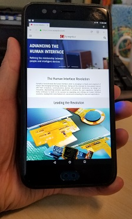

 

© 2018 Synaptics, Incorporated. All Rights Reserved

# Project Tourmalet - A Portable Multimedia player and Android Design Kit #
last update: May 10, 2018

Contact [Synaptics](mailto:tourmalet@synaptics.com)

The files in this repository, except where otherwise noted, are licensed under the Apache License, Version 2.0 (the "License"); you may not use these files except in compliance with the License. You may obtain a copy of the License at http://www.apache.org/licenses/LICENSE-2.0

*Legal Disclaimer: The information contained in this repository ("Tourmalet") is provided "as is," and Synaptics makes no warranties, express, implied, statutory, or otherwise, regarding Tourmalet or any related documentation.  Synaptics disclaims all liability of any kind in connection with Tourmalet and related documentation and specifically disclaims any implied warranties of noninfringement, title, merchantability, or fitness for a particular purpose, or arising from a course of dealing or usage of trade.* 

----------

Welcome to the Project Tourmalet Repository.  This should be the first document that you read about this project.  Here, you will find a high level description of the purpose, intent and vision of this project.  You will also find a roadmap of the other files and documents that are included in this repository.  

TL;DR: READ THIS DOCUMENT FIRST.  It will save you time.

## What is Project Tourmalet?  Why? ##

- A build kit for a handheld device and touchscreen development kit
	- Out-of-the-box experience (well, once assembled) as a handheld Android device – impress your friends with a hand-built Android device that can serve as a wireless communicator, music player, social media portal, etc.
	- Usable as a touchscreen development kit to enable touchscreen UI and GPIO access for other projects
- For the recreational hobbyist, a kit to build an Android handheld!
	- Build-it-yourself, battery operated handheld device kit with step-by-step instructions.  HW and SW binary image fully tested to work (so long as you follow our instructions).
	- Fully working high-end media player: FHD touchscreen, USB ports, rechargeable battery, WiFi and Bluetooth. FHD display comparable to any commercially available media player or low-end cell phone.
	- Runs Android OS, can install Amazon AppStore and run apps like Facebook, YouTube, FireFox. Infinitely customizable/personalizeable as HW and SW is "open sourced".
- For the advanced hobbyist, an extensible HD touchscreen development kit
	- Synaptics TDDI FHD touchscreen display easily outperforms other touchscreens currently available to hobbyists.
	- "Simplify" hobbyist touch-screen design-in experience for projects requiring touchscreen
		- Pre-defined touchscreen with HD display, sample source, GUI builder SW
		- NO SENSOR TUNING.  Touchscreen reports multi-finger touch "out-of-the-box" 
	- "...better than ripping apart a production handset just to get to the touchscreen"
		- I/O ports accessible to wire-in additional HW
		- Entire device documentation available (HW schematics, board files, casing design, SW source, etc.)

Project Tourmalet started as an internal Synaptics project to help our engineers learn more about the Synaptics Touch-Display Driver Integration (TDDI) technology.  This pioneering technology enables high-performance in-cell touchscreen display technology by co-locating the capacitive touch sensing circuits directly in the same silicon as the display driver circuits.  

As a service to the Maker community, Synaptics has now made this advanced display technology available on a widely available, hobbyist platform (the Qualcomm Dragonboard 410c).  Furthermore, because we ourselves like to make usable platforms, we have released all the instructions and documentation to enable the Maker community to build a complete stand-alone Android device using the Synaptics TDDI FHD touchscreen. 

The original intent for the Tourmalet kit was to create a design kit that was straightforward enough that even a recreational hobbyist could assemble it him/herself, just like putting together a Lego design or an Ikea furniture.  Accordingly, emphasis was placed on making the mechanical design and assembly simple and robust, at the slight penalty for sleekness and cost.  So yes, the overall design could have been optimized to make the device thinner, but that would have made assembling the device even more challenging.  Additionally, aside from the touchscreen display, we also wanted to make sure most of the components (such as the battery, processor platform, etc.) were easy to source.  We even tested the casing design to be printable using hobbyist-class FDM printers (not just the high-end objet printers).  

That said, we do recognize that the Synaptics-enabled TDDI touchscreen and the main daughterboard and adaptor board that connects the display to the Dragonboard are both not available on the open market.  Full documentation for these two boards are included (in the *Synaptics_Boards* directory) so you could make your own.  However, Synaptics intends on working with suppliers in the Maker community to make these displays and the support components available. Contact [Synaptics](mailto:tourmalet@synaptics.com?subject=Tourmalet%20availability%20request) for further information.  

## How do I get started? ##
Now that we've captured your interest in building your own Android device, the next step is to work through the rest of the collateral and documentation in this repository (in the *Docs* to build your own Tourmalet device. A quick tour (in approximate order of how you will build your device):

1. [The Bill of Materials](Docs/BOM.md). This document contains all the hardware components needed to assemble the device.  Links to where our team sourced the component are also provided.
2. [The Assembly Instructions](Docs/Assembly.md).  Once you have gathered all your components, here are the step-by-step instructions on how to assemble the device.
3. [Installing Android](Docs/InstallingAndroid.md). Once you have your device completely assembled, this document shows you how to install the software binary image onto your device.  In this repository, we have already included a working binary (assuming you used the same exact hardware we specified in the BOM), so you can just install this binary onto your device.  Otherwise, you can try your hand at building your own binary with our [Building Android](Docs/BuildingAndroid.md) guide (see below).
4. [User Guide](Docs/UserGuide.md). What to know about the device and how to use it. Includes a basic spec sheet for the device.
5. [Developer Guide](Docs/DeveloperGuide.md). How to access Tourmalet's hardware in Android apps (or from your PC).
6. *For Advanced Hobbyists only:* [Building Android](Docs/BuildingAndroid.md).  Read this if you are interested in compiling your own Android binary for Tourmalet.  For most hobbyists, you can just use the pre-built binary we have included in the repository.  Building a new binary is really only necessary if you want to see how an Android binary is built (the included scripts and patches are what we used to build the binary in the repository), or if you want to modify our scripts/patches because you want to modify our hardware.  
7. No project would be complete without an [Errata](Docs/Errata.md).  Sadly, not everything is working and there are some things that don't behave as ideally as they should.  Perhaps, you can think of this document as a suggestion list for future projects!
